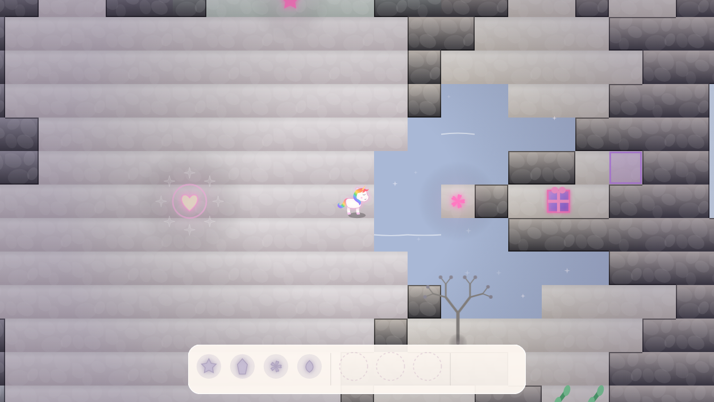

# Rainbow Vale

A top-down puzzle-adventure built for the [js13k](https://js13kgames.com/) competition —
the whole game, including every asset, fits in **13,312 bytes zipped**. No libraries, no
images, no audio files: everything you see and hear is generated by the code itself.

## Story

The Vale was once alive with color — until it wasn't. Clover Fields, Cloud Cavern,
Sunbeam Grove and Starlight Marsh have all faded to grey, their magic scattered and
their treasures lost. You're a small rainbow unicorn with just enough spark left to
set things right: find the runes, relearn the old spells, and bring every treasure
home to the altar at the Vale's heart.

## How to Play

Explore each of the four realms and collect its rune. Combine up to three runes into
a spell phrase — the first sets its **nature** (push, freeze, cut, crack), the second
its **shape** (a line, an arc, a cone...), and an optional third twists the effect
(go through further, spread wider, mirror it back).

Use your spells to solve each realm's puzzles: push crates onto pressure plates,
freeze water into stepping stones, cut through overgrown vines, crack open blocked
walls, or bounce a spell off a mirror to reach somewhere you can't aim at directly.
Dig out the hidden treasure in each zone and carry it back to the altar — restore
them all, and the Vale blooms back into color.

## Controls

| Key | Action |
|---|---|
| Arrow keys / WASD / ZQSD | Move |
| Click a rune, or 1 – 4 | Add that rune to your spell (up to 3) |
| Space / Enter, or Cast | Release the spell |
| Backspace | Remove the last rune |
| B, or Undo | Take back your last move |

The spell bar along the bottom is always live — no menu to open, just start typing runes.

---

See [TECHNICAL.md](TECHNICAL.md) for the project structure and build instructions.
